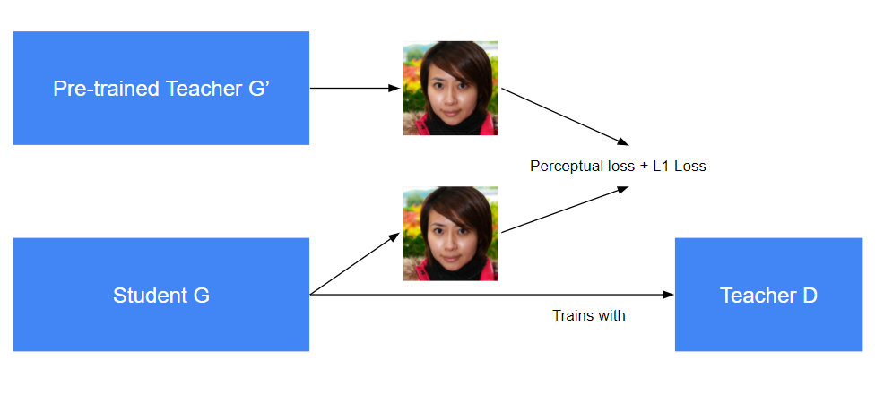

## StyleGAN2-ADA &mdash; Official PyTorch implementation

**Description**

This is an experiment on StyleGAN2 model compression using knowledge distillation technique. The compressed model (a model with smaller channel size) is trained with a teacher-student paradigm.



Using a pre-trained model, we train a smaller sized model to be able to outperform the original trained model.

**Original Repositry**<br>

https://github.com/NVlabs/stylegan2-ada-pytorch

Original codebase can be assessed on the master branch as well.

## Requirements

* Linux and Windows are supported, but we recommend Linux for performance and compatibility reasons.
* 1&ndash;8 high-end NVIDIA GPUs with at least 12 GB of memory. We have done all testing and development using NVIDIA DGX-1 with 8 Tesla V100 GPUs.
* 64-bit Python 3.7 and PyTorch 1.7.1. See [https://pytorch.org/](https://pytorch.org/) for PyTorch install instructions.
* CUDA toolkit 11.0 or later.  Use at least version 11.1 if running on RTX 3090.  (Why is a separate CUDA toolkit installation required?  See comments in [#2](https://github.com/NVlabs/stylegan2-ada-pytorch/issues/2#issuecomment-779457121).)
* Python libraries: `pip install click requests tqdm pyspng ninja imageio-ffmpeg==0.4.3 lpips`.
* Docker users: use the [provided Dockerfile](./Dockerfile) to build an image with the required library dependencies.

The code relies heavily on custom PyTorch extensions that are compiled on the fly using NVCC. On Windows, the compilation requires Microsoft Visual Studio. We recommend installing [Visual Studio Community Edition](https://visualstudio.microsoft.com/vs/) and adding it into `PATH` using `"C:\Program Files (x86)\Microsoft Visual Studio\<VERSION>\Community\VC\Auxiliary\Build\vcvars64.bat"`.

**Docker**: You can run the above curated image example using Docker as follows:

```.bash
docker build --tag sg2ada:latest .
./docker_run.sh python3 generate.py --outdir=out --trunc=1 --seeds=85,265,297,849 \
    --network=https://nvlabs-fi-cdn.nvidia.com/stylegan2-ada-pytorch/pretrained/metfaces.pkl
```

Note: The Docker image requires NVIDIA driver release `r455.23` or later.

**Legacy networks**: The above commands can load most of the network pickles created using the previous TensorFlow versions of StyleGAN2 and StyleGAN2-ADA. However, for future compatibility, we recommend converting such legacy pickles into the new format used by the PyTorch version:

```.bash
python legacy.py \
    --source=https://nvlabs-fi-cdn.nvidia.com/stylegan2/networks/stylegan2-cat-config-f.pkl \
    --dest=stylegan2-cat-config-f.pkl
```

## Preparing datasets

Datasets are stored as uncompressed ZIP archives containing uncompressed PNG files and a metadata file `dataset.json` for labels.

Custom datasets can be created from a folder containing images; see [`python dataset_tool.py --help`](./docs/dataset-tool-help.txt) for more information. Alternatively, the folder can also be used directly as a dataset, without running it through `dataset_tool.py` first, but doing so may lead to suboptimal performance.

Legacy TFRecords datasets are not supported &mdash; see below for instructions on how to convert them.

**FFHQ**:

Step 1: Download the [Flickr-Faces-HQ dataset](https://github.com/NVlabs/ffhq-dataset) as TFRecords.

Step 2: Extract images from TFRecords using `dataset_tool.py` from the [TensorFlow version of StyleGAN2-ADA](https://github.com/NVlabs/stylegan2-ada/):

```.bash
# Using dataset_tool.py from TensorFlow version at
# https://github.com/NVlabs/stylegan2-ada/
python ../stylegan2-ada/dataset_tool.py unpack \
    --tfrecord_dir=~/ffhq-dataset/tfrecords/ffhq --output_dir=/tmp/ffhq-unpacked
```

Step 3: Create ZIP archive using `dataset_tool.py` from this repository:

```.bash
# Original 1024x1024 resolution.
python dataset_tool.py --source=/tmp/ffhq-unpacked --dest=~/datasets/ffhq.zip

# Scaled down 256x256 resolution.
python dataset_tool.py --source=/tmp/ffhq-unpacked --dest=~/datasets/ffhq256x256.zip \
    --width=256 --height=256
```

**MetFaces**: Download the [MetFaces dataset](https://github.com/NVlabs/metfaces-dataset) and create ZIP archive:

```.bash
python dataset_tool.py --source=~/downloads/metfaces/images --dest=~/datasets/metfaces.zip
```

**AFHQ**: Download the [AFHQ dataset](https://github.com/clovaai/stargan-v2/blob/master/README.md#animal-faces-hq-dataset-afhq) and create ZIP archive:

```.bash
python dataset_tool.py --source=~/downloads/afhq/train/cat --dest=~/datasets/afhqcat.zip
python dataset_tool.py --source=~/downloads/afhq/train/dog --dest=~/datasets/afhqdog.zip
python dataset_tool.py --source=~/downloads/afhq/train/wild --dest=~/datasets/afhqwild.zip
```

**CIFAR-10**: Download the [CIFAR-10 python version](https://www.cs.toronto.edu/~kriz/cifar.html) and convert to ZIP archive:

```.bash
python dataset_tool.py --source=~/downloads/cifar-10-python.tar.gz --dest=~/datasets/cifar10.zip
```

**LSUN**: Download the desired categories from the [LSUN project page](https://www.yf.io/p/lsun/) and convert to ZIP archive:

```.bash
python dataset_tool.py --source=~/downloads/lsun/raw/cat_lmdb --dest=~/datasets/lsuncat200k.zip \
    --transform=center-crop --width=256 --height=256 --max_images=200000

python dataset_tool.py --source=~/downloads/lsun/raw/car_lmdb --dest=~/datasets/lsuncar200k.zip \
    --transform=center-crop-wide --width=512 --height=384 --max_images=200000
```

**BreCaHAD**:

Step 1: Download the [BreCaHAD dataset](https://figshare.com/articles/BreCaHAD_A_Dataset_for_Breast_Cancer_Histopathological_Annotation_and_Diagnosis/7379186).

Step 2: Extract 512x512 resolution crops using `dataset_tool.py` from the [TensorFlow version of StyleGAN2-ADA](https://github.com/NVlabs/stylegan2-ada/):

```.bash
# Using dataset_tool.py from TensorFlow version at
# https://github.com/NVlabs/stylegan2-ada/
python dataset_tool.py extract_brecahad_crops --cropsize=512 \
    --output_dir=/tmp/brecahad-crops --brecahad_dir=~/downloads/brecahad/images
```

Step 3: Create ZIP archive using `dataset_tool.py` from this repository:

```.bash
python dataset_tool.py --source=/tmp/brecahad-crops --dest=~/datasets/brecahad.zip
```

## Distilling the network

First, make sure that there is a pre-trained teacher model trained with the original codebase (can be found in the master branch). Next, define a configuration under cfg_specs 
in [`train.py`] for the student model. You can reduce fmaps to get a smaller sized model. Run the following command to begin the distilling process:

```.bash
python train.py \
--outdir=~/training-runs \
--data=~/FFHQ256.zip \
--teacher=~/teachermodel.pkl
--source_res=256 \
--target_res=256 \
--gpus=1
```

Additional ```.bash --dry-run``` flag can be added to test the commands.

The training configuration can be further customized with additional command line options:

* `--aug=noaug` disables ADA.
* `--cond=1` enables class-conditional training (requires a dataset with labels).
* `--mirror=1` amplifies the dataset with x-flips. Often beneficial, even with ADA.
* `--resume=ffhq1024 --snap=10` performs transfer learning from FFHQ trained at 1024x1024.
* `--resume=~/training-runs/<NAME>/network-snapshot-<INT>.pkl` resumes a previous training run.
* `--gamma=10` overrides R1 gamma. We recommend trying a couple of different values for each new dataset.
* `--aug=ada --target=0.7` adjusts ADA target value (default: 0.6).
* `--augpipe=blit` enables pixel blitting but disables all other augmentations.
* `--augpipe=bgcfnc` enables all available augmentations (blit, geom, color, filter, noise, cutout).

Please refer to [`python train.py --help`](./docs/train-help.txt) for the full list.

## Quality metrics

By default, `train.py` automatically computes FID for each network pickle exported during training. We recommend inspecting `metric-fid50k_full.jsonl` (or TensorBoard) at regular intervals to monitor the training progress. When desired, the automatic computation can be disabled with `--metrics=none` to speed up the training slightly (3%&ndash;9%).

Additional quality metrics can also be computed after the training:

```.bash
# Previous training run: look up options automatically, save result to JSONL file.
python calc_metrics.py --metrics=pr50k3_full \
    --network=~/training-runs/00000-ffhq10k-res64-auto1/network-snapshot-000000.pkl

# Pre-trained network pickle: specify dataset explicitly, print result to stdout.
python calc_metrics.py --metrics=fid50k_full --data=~/datasets/ffhq.zip --mirror=1 \
    --network=https://nvlabs-fi-cdn.nvidia.com/stylegan2-ada-pytorch/pretrained/ffhq.pkl
```

## Citation

```
@inproceedings{Karras2020ada,
  title     = {Training Generative Adversarial Networks with Limited Data},
  author    = {Tero Karras and Miika Aittala and Janne Hellsten and Samuli Laine and Jaakko Lehtinen and Timo Aila},
  booktitle = {Proc. NeurIPS},
  year      = {2020}
}
```
